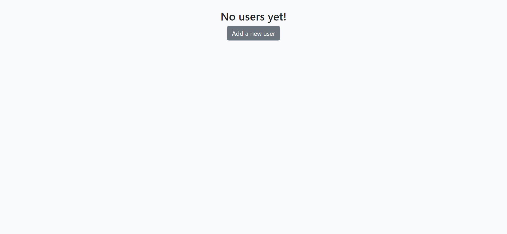
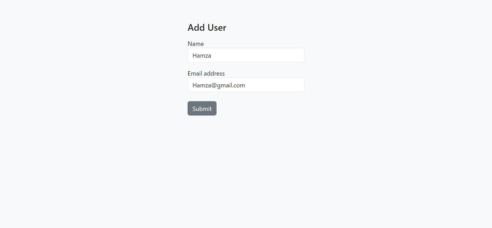
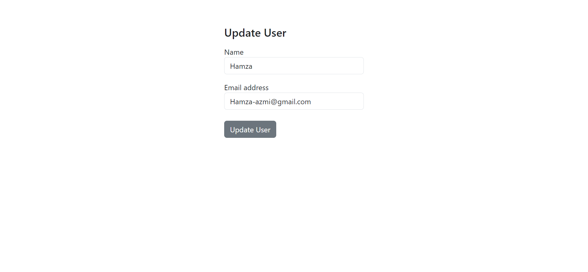
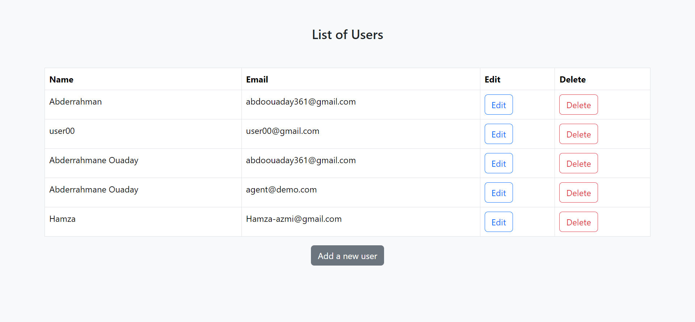

# Simple Project using Spring Boot and Thymeleaf

## Objective

## Technologies Used
- **Thymeleaf**: Java framework for developing component-based web applications.
- **Java EE (Enterprise Edition)**: Execution platform for Java enterprise applications.
- **Java Persistence API (JPA)**: Java specification for managing data persistence.
- **MySQL**: Database for storing application data.
- **Spring Boot**

## Features

## Project Structure

## Configuration

## Home page

## User add

## User update

## User list

